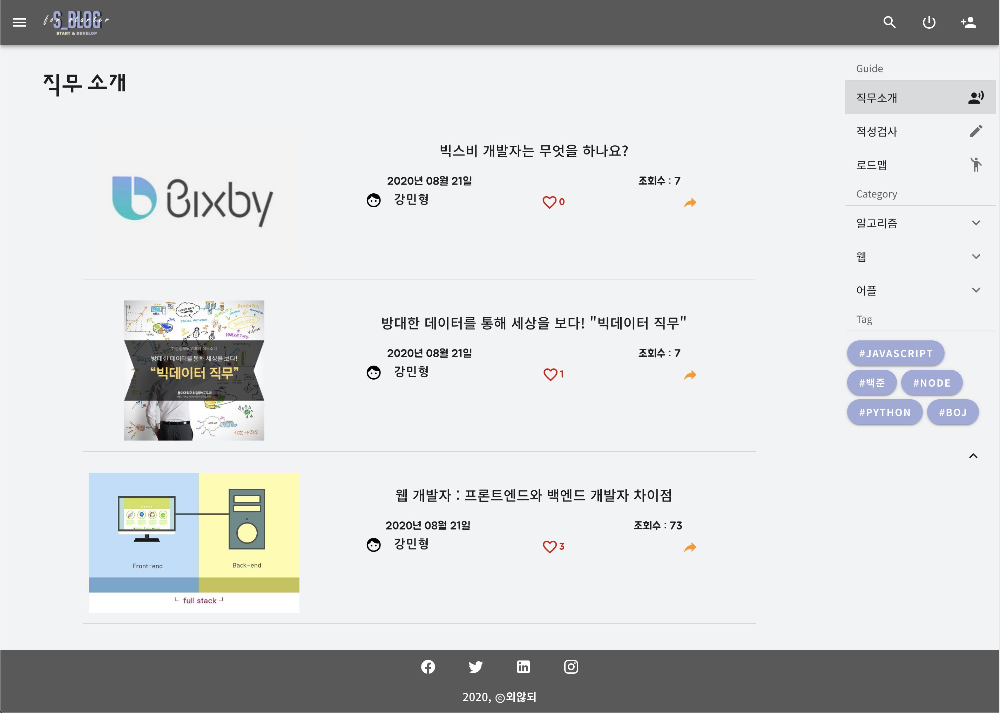
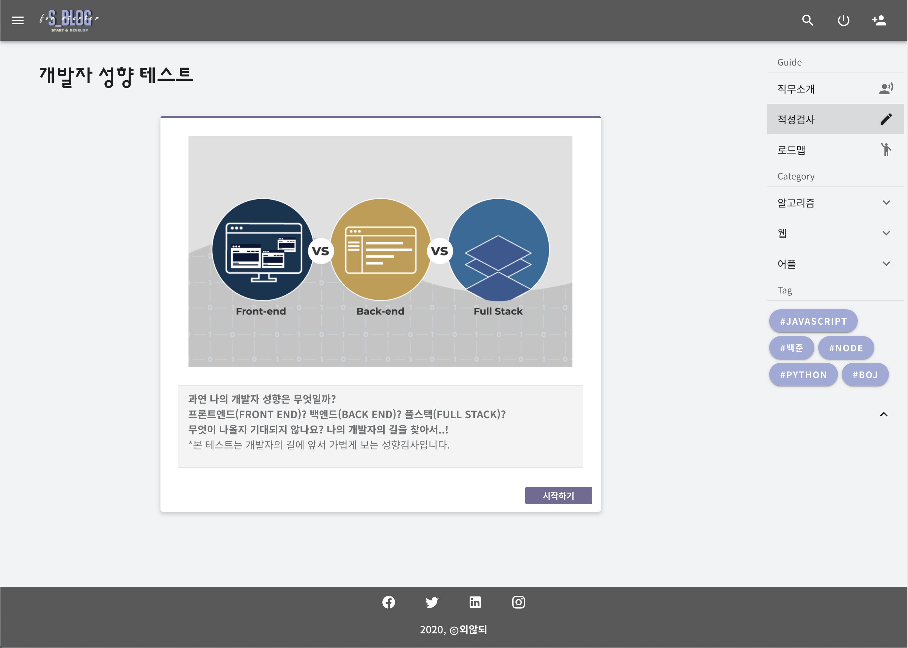
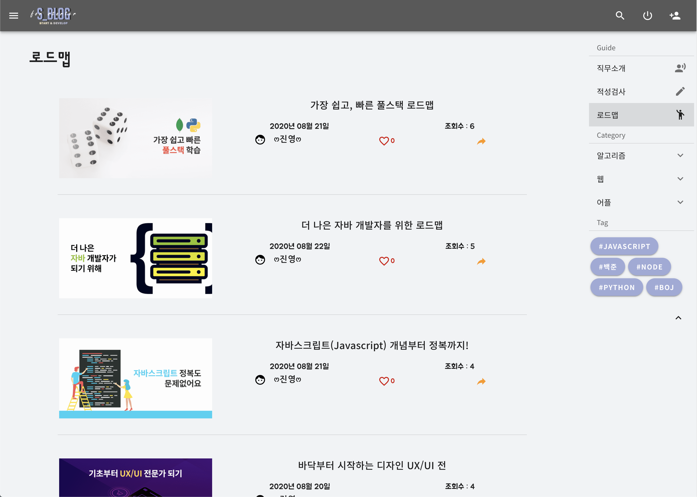
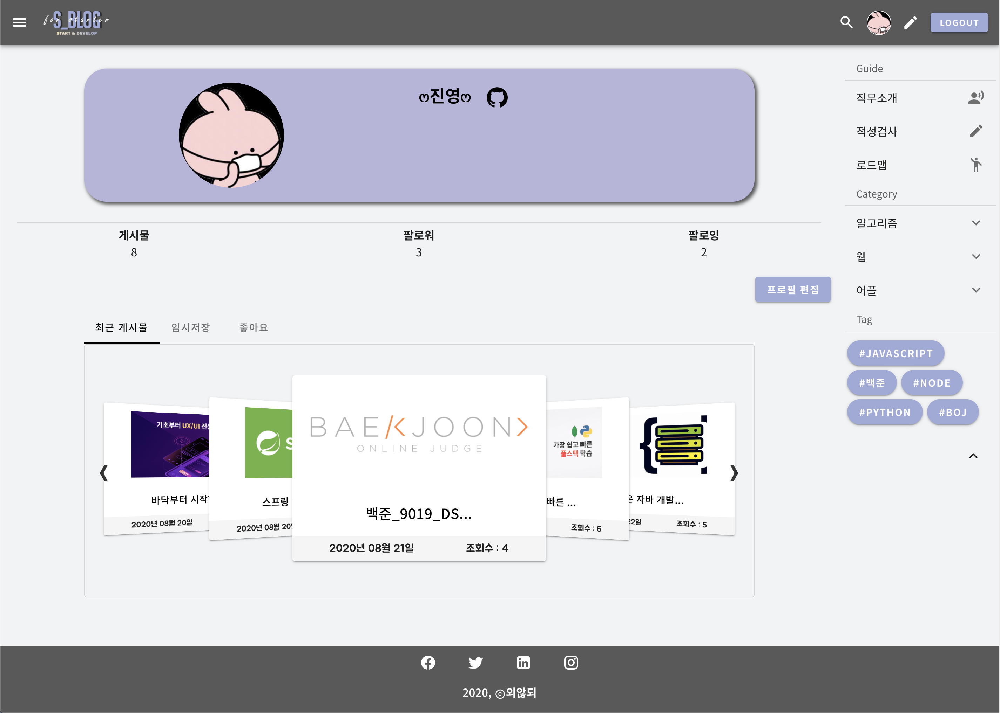
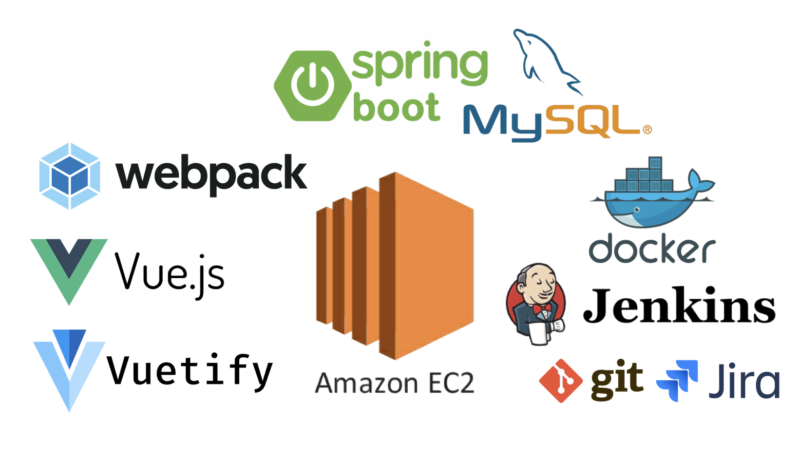
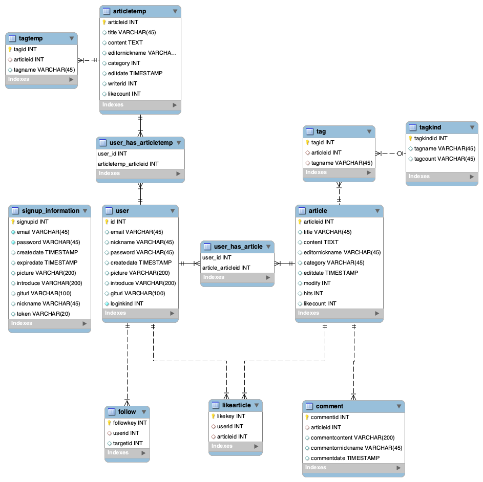

#  S_BLOG

**SSAFY 3기 6반 외않되**

## Overview

&nbsp; 개발자가 되고싶은 스타터들을 위한 웹 블로그


<br>

### **Q. 개발자에게는 어떤 직군이 있나요?**



<br>

### **Q. 제게 어울리는 직무는 뭘까요?**



<br>

### **Q. 이 직무를 위해 뭘 해야 할까요?**



<br>

### **Q. 제게 필요한 정보만 골라서 보고 싶어요!**



<br>

## Contributors

| Name   | GitHub                                        | Role     |
| ------ | --------------------------------------------- | -------- |
| 강민형 | [rkdals213](https://github.com/rkdals213)     | BackEnd  |
| 이진영 | [leejinzero](https://github.com/leejinzero)   | FrontEnd |
| 박춘화 | [Winters0727](https://github.com/Winters0727) | FrontEnd |

<br>

## Build

### FrontEnd

```sh
cd WebBlogProject_FrontEnd
npm install
npm run build
```

### BackEnd

```sh
cd WebBlogProject_BackEnd
mvn package
cd target
java -jar demo-0.0.1-SNAPSHOT.jar
```

<br>

## Tech Stack



<br>

## ERD


